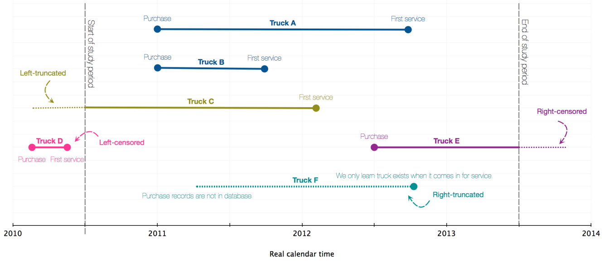
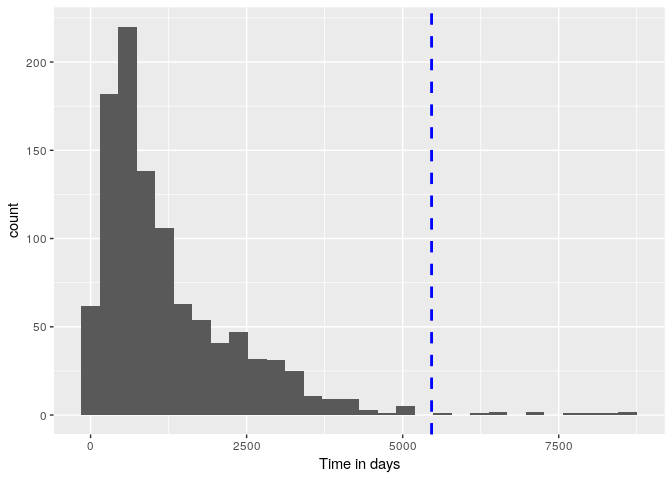
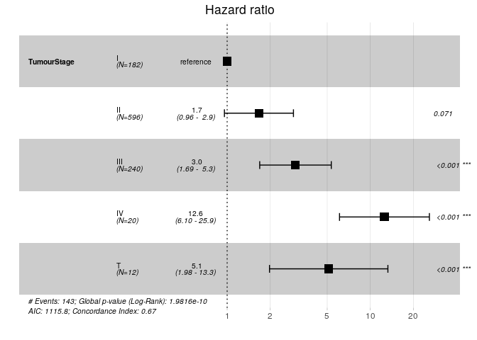
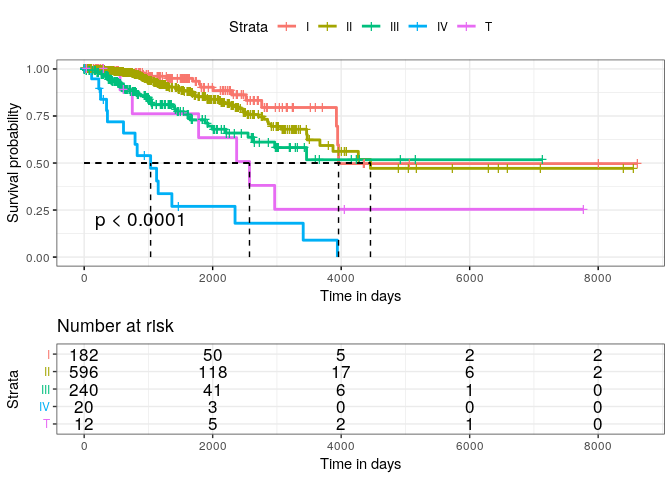

In this example we will analyse the survival profile of breast cancer patients from the TCGA (BRCA TCGA). Specifically, we will look at the impact of age @ diagnosis and cancer stage (I, II, III, IV or Terminal) on survival.


## Stage 0: Essential variables

When analysis survival differentials in a data set, a vast range of variables will be important in creating sound and significant models. Largely, these fall in 3 categories:

* Covariates: any exogenous factor that enrich the analysis. Ex: smoking status, sex, blood biomarker levels, disease status, etc...
* Events: the outcome of interest, has to be binary (0=outcome not happened, 1=outcome happened) or at the very least it has to be ordinal (Ex: outcome is disease severity: 1,2 .., n for some very small n). In the example of this document, the outcome of interest is death by breast cancer. Any patient that dies of breast cancer related complications within the specified observation time is marked with outcome=1, otherwise they are marked with outcome=0. 
  + If a patient dies of anything other than breast cancer (ex: CVD, respiratory disease, accident,...), they have outcome=0
  + If a patient dies of breast cancer after the end of the observation period, they also have outcome=0
  + If a patient is lost in follow up (ex: they disappeared, changed hospitals and records got lost,...) before the end of the observation period, no matter their fate, they are marked with outcome=0 - we refer to that as censoring (more on that below)
* Time line & Cencoring: the variables that delimitate the start and end of the observation period:
  + The start is set to when patients/subjects enter the study. In the context of a RCT or experiment, that's when the experiment start, and that time is identical for everyone (T_start = 0). In the context of a longitudinal study, with data coming from various sources like TCGA, this is set as the time patients are put under observations, i.e. when they are diagnosed and begin their treament journey. 
  + The end is set to be the end of the observation period. For a RCT/experiment, this is set by the scientists who made the experimental design (T_end = $\gamma$ for everyone). For longitudinal analyses like ours, we have to look at when **most** subjects are lost to follow-up. That won't capture absolutely everyone, but that's what we want by design - by doing that we implicitly exclude "outliers". 
    - Note: we can (should) also do that with the start of the observation period when doing left-censoring.
  + The time unit of the study has to be well specified and uniform across the data set of interest. Depending on the experimental design, it can be hours, days, months or even years. Making it too coarse will render unprecise results, while making it too thin will make the model over-complicated. For a cancer survival analysis, months or years are appropriate time scales.
  


Example: censoring from a Truck durability analysis. Here, the outcome of interest is 1st ever service; The observation period is set between June 2010 and June 2013. T_start = purchase time, note that these can also fall outside the observation period - we then "left-censor" them. T_end = time of first ever service, or end of observation period, whichever comes first - that's "right-censoring"

### A note on confounders

Any survival analysis for a factor on an outcome needs to be adjusted for confounding variables. In the context of death, **Age and gender *always* need to be included **. The only exceptions are if:

1) everyone in the study cohort is the same age,
2) the outcome of interest is sex-specific. This is the case for us here, as we are looking at women with breast cancer

## Stage 1: Table One

It is essential to start with an overview of the study cohort with a summary table with a couple of basic statistics


```r
library(tableone)
library(kableExtra)
#
df<-df[!is.na(df$days_to_birth),] # exclude people with no Age
df$Age.yr<-(-1)*df$days_to_birth/365 # Convert days to birth into age in yrs
#
# Define censoring time based on survival outcome - in days
df$end<-ifelse(df$vital_status=="Alive",df$days_to_last_follow_up,df$days_to_death) 
# exclude people with no censoring time + those who died in negative time 
df<-df[(!is.na(df$end))&(df$end>0),]
# censoring time - in years of life
df$end.yr<-df$end/365+df$Age.yr 
#
#####
#
Df.table<-df[,colnames(df) != "submitter_id"]
Df.table<-Df.table %>% 
  rename( Censoring_Time=end, Censoring_age=end.yr)
varstofact<-c("vital_status","TumourStage")
Df.table[varstofact] <- lapply(Df.table[varstofact], factor)
Vars<-c(varstofact,"Age.yr","Censoring_Time","Censoring_age")
###
tableOne <- CreateTableOne(vars = Vars,data=Df.table)

T1<-kableone(tableOne)

T1 %>%
  kable_styling(bootstrap_options = "striped", full_width = F)
```

<table class="table table-striped" style="width: auto !important; margin-left: auto; margin-right: auto;">
 <thead>
  <tr>
   <th style="text-align:left;">   </th>
   <th style="text-align:left;"> Overall </th>
  </tr>
 </thead>
<tbody>
  <tr>
   <td style="text-align:left;"> n </td>
   <td style="text-align:left;"> 1050 </td>
  </tr>
  <tr>
   <td style="text-align:left;"> vital_status = Dead (%) </td>
   <td style="text-align:left;"> 145 (13.8) </td>
  </tr>
  <tr>
   <td style="text-align:left;"> TumourStage (%) </td>
   <td style="text-align:left;">  </td>
  </tr>
  <tr>
   <td style="text-align:left;"> I </td>
   <td style="text-align:left;"> 182 (17.3) </td>
  </tr>
  <tr>
   <td style="text-align:left;"> II </td>
   <td style="text-align:left;"> 596 (56.8) </td>
  </tr>
  <tr>
   <td style="text-align:left;"> III </td>
   <td style="text-align:left;"> 240 (22.9) </td>
  </tr>
  <tr>
   <td style="text-align:left;"> IV </td>
   <td style="text-align:left;"> 20 ( 1.9) </td>
  </tr>
  <tr>
   <td style="text-align:left;"> T </td>
   <td style="text-align:left;"> 12 ( 1.1) </td>
  </tr>
  <tr>
   <td style="text-align:left;"> Age.yr (mean (SD)) </td>
   <td style="text-align:left;"> 58.80 (12.93) </td>
  </tr>
  <tr>
   <td style="text-align:left;"> Censoring_Time (mean (SD)) </td>
   <td style="text-align:left;"> 1256.86 (1179.64) </td>
  </tr>
  <tr>
   <td style="text-align:left;"> Censoring_age (mean (SD)) </td>
   <td style="text-align:left;"> 62.25 (12.78) </td>
  </tr>
</tbody>
</table>

With the package tableone, you can also compute summary statistics across specific groups of the cohort, complete with group means comparison p-values for each variable.


```r
Vars<-c("TumourStage","Age.yr","Censoring_Time","Censoring_age")

tableTwo<-CreateTableOne(vars = Vars,strata="vital_status",data=Df.table)

T2<-kableone(tableTwo)

T2 %>%
  kable_styling(bootstrap_options = "striped", full_width = F)
```

<table class="table table-striped" style="width: auto !important; margin-left: auto; margin-right: auto;">
 <thead>
  <tr>
   <th style="text-align:left;">   </th>
   <th style="text-align:left;"> Alive </th>
   <th style="text-align:left;"> Dead </th>
   <th style="text-align:left;"> p </th>
   <th style="text-align:left;"> test </th>
  </tr>
 </thead>
<tbody>
  <tr>
   <td style="text-align:left;"> n </td>
   <td style="text-align:left;"> 905 </td>
   <td style="text-align:left;"> 145 </td>
   <td style="text-align:left;">  </td>
   <td style="text-align:left;">  </td>
  </tr>
  <tr>
   <td style="text-align:left;"> TumourStage (%) </td>
   <td style="text-align:left;">  </td>
   <td style="text-align:left;">  </td>
   <td style="text-align:left;"> &lt;0.001 </td>
   <td style="text-align:left;">  </td>
  </tr>
  <tr>
   <td style="text-align:left;"> I </td>
   <td style="text-align:left;"> 166 (18.3) </td>
   <td style="text-align:left;"> 16 (11.0) </td>
   <td style="text-align:left;">  </td>
   <td style="text-align:left;">  </td>
  </tr>
  <tr>
   <td style="text-align:left;"> II </td>
   <td style="text-align:left;"> 532 (58.8) </td>
   <td style="text-align:left;"> 64 (44.1) </td>
   <td style="text-align:left;">  </td>
   <td style="text-align:left;">  </td>
  </tr>
  <tr>
   <td style="text-align:left;"> III </td>
   <td style="text-align:left;"> 196 (21.7) </td>
   <td style="text-align:left;"> 44 (30.3) </td>
   <td style="text-align:left;">  </td>
   <td style="text-align:left;">  </td>
  </tr>
  <tr>
   <td style="text-align:left;"> IV </td>
   <td style="text-align:left;"> 5 ( 0.6) </td>
   <td style="text-align:left;"> 15 (10.3) </td>
   <td style="text-align:left;">  </td>
   <td style="text-align:left;">  </td>
  </tr>
  <tr>
   <td style="text-align:left;"> T </td>
   <td style="text-align:left;"> 6 ( 0.7) </td>
   <td style="text-align:left;"> 6 ( 4.1) </td>
   <td style="text-align:left;">  </td>
   <td style="text-align:left;">  </td>
  </tr>
  <tr>
   <td style="text-align:left;"> Age.yr (mean (SD)) </td>
   <td style="text-align:left;"> 58.36 (12.58) </td>
   <td style="text-align:left;"> 61.56 (14.72) </td>
   <td style="text-align:left;"> 0.006 </td>
   <td style="text-align:left;">  </td>
  </tr>
  <tr>
   <td style="text-align:left;"> Censoring_Time (mean (SD)) </td>
   <td style="text-align:left;"> 1212.41 (1169.06) </td>
   <td style="text-align:left;"> 1534.27 (1211.30) </td>
   <td style="text-align:left;"> 0.002 </td>
   <td style="text-align:left;">  </td>
  </tr>
  <tr>
   <td style="text-align:left;"> Censoring_age (mean (SD)) </td>
   <td style="text-align:left;"> 61.68 (12.42) </td>
   <td style="text-align:left;"> 65.76 (14.40) </td>
   <td style="text-align:left;"> &lt;0.001 </td>
   <td style="text-align:left;">  </td>
  </tr>
</tbody>
</table>

## Stage 2: Define observation period

Here we will only look at refining the end of the observation period.

To evaluate an optimal obsertaion period for our cohort, we need to look at the distribution of right-censoring times across the cohort


```r
cf<-round(quantile(df$end,0.99)) #1% top percentile
ggplot(df, aes(x=end)) +
  geom_histogram() +
  geom_vline(aes(xintercept=cf), color="blue", linetype="dashed", size=1) +
   xlab("Time in days")
```

<!-- -->

99% of our cohort die / stop treatment 5463 days from their initial diagnosis. We will set this to be the end of our observation period. Thus, we have to update the definition of the event for those who fall outside of that


```r
df[df$end>cf,"vital_status"]<-"Alive"

table(df$vital_status) %>%
  kable() %>%
  kable_styling(bootstrap_options = "striped", full_width = F)
```

<table class="table table-striped" style="width: auto !important; margin-left: auto; margin-right: auto;">
 <thead>
  <tr>
   <th style="text-align:left;"> Var1 </th>
   <th style="text-align:right;"> Freq </th>
  </tr>
 </thead>
<tbody>
  <tr>
   <td style="text-align:left;"> Alive </td>
   <td style="text-align:right;"> 907 </td>
  </tr>
  <tr>
   <td style="text-align:left;"> Dead </td>
   <td style="text-align:right;"> 143 </td>
  </tr>
</tbody>
</table>

## Stage 3: Set up Coxph model

1) Tidy up the data frame and re-level the outcome variable. Coxph in R only accepts binary variables coded as $\{0,1\}$ in numeric format. 0= no outcome, 1=outcome.


```r
df.model<-df[,c('TumourStage','Age.yr','end','end.yr','vital_status')]
levels(df.model$vital_status)<-c(0,1)
df.model$vital_status<-as.numeric(df.model$vital_status)-1 # outcome converted from factor to numeric 
# Age variable
df.model$over65<-ifelse(df.model$Age.yr>=65,1,0)
```

3) Check for data missingness. Make sure you have no /as few Na's as possible 

```r
kable(summary(df.model)) %>%
  kable_styling(bootstrap_options = "striped", full_width = F)
```

<table class="table table-striped" style="width: auto !important; margin-left: auto; margin-right: auto;">
 <thead>
  <tr>
   <th style="text-align:left;">   </th>
   <th style="text-align:left;"> TumourStage </th>
   <th style="text-align:left;">     Age.yr </th>
   <th style="text-align:left;">      end </th>
   <th style="text-align:left;">     end.yr </th>
   <th style="text-align:left;">  vital_status </th>
   <th style="text-align:left;">     over65 </th>
  </tr>
 </thead>
<tbody>
  <tr>
   <td style="text-align:left;">  </td>
   <td style="text-align:left;"> I  :182 </td>
   <td style="text-align:left;"> Min.   :26.59 </td>
   <td style="text-align:left;"> Min.   :   1.0 </td>
   <td style="text-align:left;"> Min.   :29.64 </td>
   <td style="text-align:left;"> Min.   :0.0000 </td>
   <td style="text-align:left;"> Min.   :0.0000 </td>
  </tr>
  <tr>
   <td style="text-align:left;">  </td>
   <td style="text-align:left;"> II :596 </td>
   <td style="text-align:left;"> 1st Qu.:49.33 </td>
   <td style="text-align:left;"> 1st Qu.: 463.8 </td>
   <td style="text-align:left;"> 1st Qu.:52.84 </td>
   <td style="text-align:left;"> 1st Qu.:0.0000 </td>
   <td style="text-align:left;"> 1st Qu.:0.0000 </td>
  </tr>
  <tr>
   <td style="text-align:left;">  </td>
   <td style="text-align:left;"> III:240 </td>
   <td style="text-align:left;"> Median :58.86 </td>
   <td style="text-align:left;"> Median : 871.0 </td>
   <td style="text-align:left;"> Median :62.50 </td>
   <td style="text-align:left;"> Median :0.0000 </td>
   <td style="text-align:left;"> Median :0.0000 </td>
  </tr>
  <tr>
   <td style="text-align:left;">  </td>
   <td style="text-align:left;"> IV : 20 </td>
   <td style="text-align:left;"> Mean   :58.80 </td>
   <td style="text-align:left;"> Mean   :1256.9 </td>
   <td style="text-align:left;"> Mean   :62.25 </td>
   <td style="text-align:left;"> Mean   :0.1362 </td>
   <td style="text-align:left;"> Mean   :0.3057 </td>
  </tr>
  <tr>
   <td style="text-align:left;">  </td>
   <td style="text-align:left;"> T  : 12 </td>
   <td style="text-align:left;"> 3rd Qu.:67.86 </td>
   <td style="text-align:left;"> 3rd Qu.:1691.0 </td>
   <td style="text-align:left;"> 3rd Qu.:70.67 </td>
   <td style="text-align:left;"> 3rd Qu.:0.0000 </td>
   <td style="text-align:left;"> 3rd Qu.:1.0000 </td>
  </tr>
  <tr>
   <td style="text-align:left;">  </td>
   <td style="text-align:left;"> NA </td>
   <td style="text-align:left;"> Max.   :90.06 </td>
   <td style="text-align:left;"> Max.   :8605.0 </td>
   <td style="text-align:left;"> Max.   :90.06 </td>
   <td style="text-align:left;"> Max.   :1.0000 </td>
   <td style="text-align:left;"> Max.   :1.0000 </td>
  </tr>
</tbody>
</table>

4) Define Surv item. It needs to have at least:
* event
* rigth censoring

This is where you can also decide whether to include left-cencoring or not - this is optional however, the model can run without it.


```r
event="vital_status"
### if right censoring only
#t="end,"
### if left + right censoring
t="Age.yr,time2=end.yr"
#
surv.gen<-paste("Surv(time=",t,",event=",event,")~",sep='')
```

Here we choose to do left+right censoring, where left censoring = age @ diagnosis, and right censoring = age @ censoring (death or end of follow-up, whichever comes first)

#### Why is Age @ diagnosis and @ end of follow-up included in the Surv() item here?

1) To adjust for the effect of Age - a very strong confounder on death. This could either be included as a linear covariate in the model. But we can do better than that;
2) To model the impact of Age in survival profiles as a non-linear, non-parametric effect

## Stage 4: Run the model


```r
library(survival)
cox.0<-coxph(as.formula(paste(surv.gen,'TumourStage',sep='')), data = df.model) 
summary(cox.0)
```

```
## Call:
## coxph(formula = as.formula(paste(surv.gen, "TumourStage", sep = "")), 
##     data = df.model)
## 
##   n= 1050, number of events= 143 
## 
##                   coef exp(coef) se(coef)     z Pr(>|z|)    
## TumourStageII   0.5112    1.6672   0.2833 1.805 0.071144 .  
## TumourStageIII  1.0993    3.0022   0.2937 3.743 0.000182 ***
## TumourStageIV   2.5305   12.5596   0.3688 6.861 6.83e-12 ***
## TumourStageT    1.6335    5.1218   0.4859 3.362 0.000774 ***
## ---
## Signif. codes:  0 '***' 0.001 '**' 0.01 '*' 0.05 '.' 0.1 ' ' 1
## 
##                exp(coef) exp(-coef) lower .95 upper .95
## TumourStageII      1.667    0.59979    0.9569     2.905
## TumourStageIII     3.002    0.33309    1.6882     5.339
## TumourStageIV     12.560    0.07962    6.0960    25.877
## TumourStageT       5.122    0.19524    1.9762    13.274
## 
## Concordance= 0.666  (se = 0.025 )
## Likelihood ratio test= 51.25  on 4 df,   p=2e-10
## Wald test            = 63.87  on 4 df,   p=4e-13
## Score (logrank) test = 83.32  on 4 df,   p=<2e-16
```


Cancer stage at diagnosis is very significant in determining survival from breast cancer, even after adjusting for age. 

## Stage 5: Present results


```r
pretty_pres_coxph<-function(x){ 
  x <- summary(x)
  p.value<-signif(x$coefficients[,5], digits=2)
  wald.test<-signif(x$coefficients[,4], digits=2)
  beta<-signif(x$coefficients[,1], digits=3);#coeficient beta
  HR <-signif(x$coefficients[,2], digits=3);#exp(beta)
  HR.confint.lower <- signif(x$conf.int[,"lower .95"],3) #signif( ,2)
  HR.confint.upper <- signif(x$conf.int[,"upper .95"],3)
  HR <- paste0(HR, " (", 
               HR.confint.lower, "-", HR.confint.upper, ")")
  res<-as.data.frame(cbind(HR, p.value))
  colnames(res)<-c("HR (95% CI for HR)", 
                "p.value")
  return(res)
}

pretty_pres_coxph(cox.0) %>%
  kable() %>%
  kable_styling()
```

<table class="table" style="margin-left: auto; margin-right: auto;">
 <thead>
  <tr>
   <th style="text-align:left;">   </th>
   <th style="text-align:left;"> HR (95% CI for HR) </th>
   <th style="text-align:left;"> p.value </th>
  </tr>
 </thead>
<tbody>
  <tr>
   <td style="text-align:left;"> TumourStageII </td>
   <td style="text-align:left;"> 1.67 (0.957-2.9) </td>
   <td style="text-align:left;"> 0.071 </td>
  </tr>
  <tr>
   <td style="text-align:left;"> TumourStageIII </td>
   <td style="text-align:left;"> 3 (1.69-5.34) </td>
   <td style="text-align:left;"> 0.00018 </td>
  </tr>
  <tr>
   <td style="text-align:left;"> TumourStageIV </td>
   <td style="text-align:left;"> 12.6 (6.1-25.9) </td>
   <td style="text-align:left;"> 6.8e-12 </td>
  </tr>
  <tr>
   <td style="text-align:left;"> TumourStageT </td>
   <td style="text-align:left;"> 5.12 (1.98-13.3) </td>
   <td style="text-align:left;"> 0.00077 </td>
  </tr>
</tbody>
</table>

Forest plots


```r
library(survminer)
ggforest(cox.0,data=df.model)
```

<!-- -->


## Stage 6: Kaplan-Meyer (KM) curves

KM curves can be very useful for viewing survival profiles in a graphical manner, for computing numbers at risk by group X time, and for evaluating median survival (50% survival threshold) by group.

Unfortunately KM curves also have quite a few drawbacks that limit their usefulness:

1) They do not accomodate for left-censoring - at least in R
2) They do not cater for continuous covariates - only categorical covariates can be fed into KM models
3) They dont allow for confounder adjustments, unlike cox models 


```r
t='end'
my.formula<-as.formula("Surv(time=end,event=vital_status)~TumourStage") #
sd <- survdiff(my.formula, data = df.model)
p.val.KM<-1 - pchisq(sd$chisq, length(sd$n) - 1) # exact log-rank test p-value 
p.val.KM<-formatC(p.val.KM, format = "e", digits = 2)
surv_item= surv_fit(my.formula,data=df.model)
ggsurv<-ggsurvplot(surv_item, data=df.model,
           #fun = "cumhaz", # for cumul. hazard
           pval = TRUE, # p-value of log-rank test of diff between strata
           # conf.int = TRUE, not great if you have multiple strata
           surv.plot.height = 0.7,
           risk.table = TRUE, # Add risk table
           risk.table.height = 0.35, # Useful when you have multiple groups
           xlab = "Time in days",   # customize X axis label.
           surv.median.line = "hv",  # add the median survival pointer.
           # ncensor.plot = TRUE,      # plot the number of censored subjects at time t
           # ncensor.plot.height = 0.6,
          ggtheme = theme_bw(),xlim=c(0,round(max(df.model[,t],na.rm = TRUE))),
          legend.labs = c("I", "II", "III", "IV", "T"))
ggsurv
```

<!-- -->
